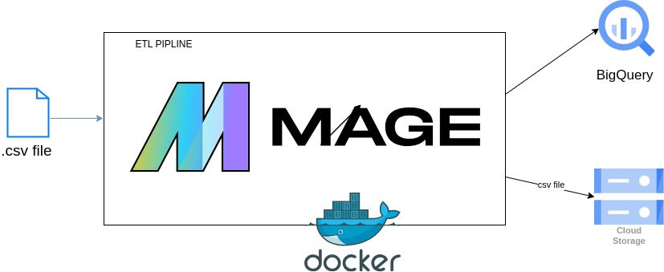

This is an ETL pipeline using mage as a data orchestration tool. The pipeline is designed to extract data from a CSV file, clean it (transform) and load it into BigQuery and GCS.

### Prerequisites
* Python 3.7
* Terraform
* Docker
* GCloud account
* Service account with BigQuery admin, Storage admin and Compute admin roles
* A CSV file with data to be loaded 
* .env file with the following variables:
     '''PROJECT_NAME=project_name
        POSTGRES_DBNAME=postgres
        POSTGRES_SCHEMA=public
        POSTGRES_USER=postgres
        POSTGRES_PASSWORD=postgres
        POSTGRES_HOST=postgres
        POSTGRES_PORT=5432
    '''
* .json file with service account credentials, store it in the same directory as the Dockerfile

### Installation
* Clone the repository:
    ```
    git clone https://github.com/MedEZZOUAK/project_mage.git
    ```
* Build the docker image:
    ```
    docker compose build
    ```
* Run the docker container:
    ```
    docker compose up -d
    ```
* To check mage visit http://localhost:6789
* Create the bucket using terraform:
    ```
    cd terraform
    terraform init
    terraform apply
    ```

**Note:** Make sure to change the bucket name, project id and credentials path in the `main.tf` file

## Usage
Using the GUI of mage run the pipeline 'project_pipeline' and pass the csv file as a parameter in 'load_data' task




